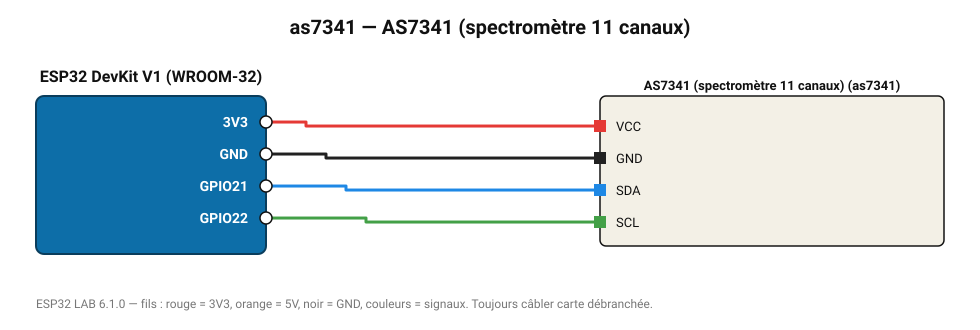

# AS7341 (spectromètre 11 canaux)

Mini-spectromètre : 8 bandes visibles de 415 à 680 nm, proche IR et lumière claire.

**Carte :** ESP32 DevKit V1 (WROOM-32) — moniteur série 115200 bauds.

| ESP32 | Composant | Broche | Couleur fil | Remarque |
|---|---|---|---|---|
| 3V3 | AS7341 (spectromètre 11 canaux) | VCC | rouge |  |
| GND | AS7341 (spectromètre 11 canaux) | GND | noir |  |
| GPIO21 | AS7341 (spectromètre 11 canaux) | SDA | bleu |  |
| GPIO22 | AS7341 (spectromètre 11 canaux) | SCL | vert |  |

Toujours câbler **carte débranchée**. Masse (GND) commune entre tous les modules.
