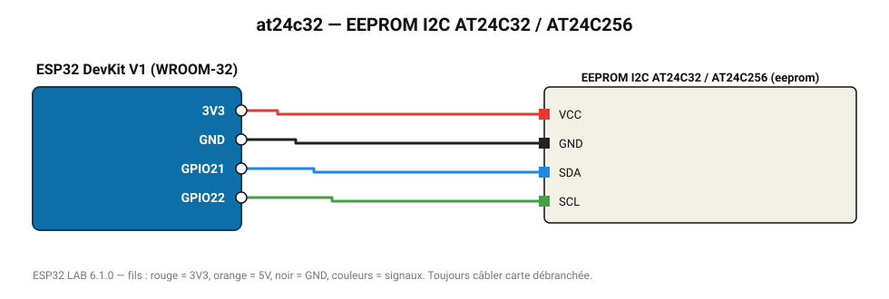

# EEPROM I2C AT24C32 / AT24C256

Mémoire non volatile externe : compteur de démarrages conservé hors tension.

**Carte :** ESP32 DevKit V1 (WROOM-32) — moniteur série 115200 bauds.

| ESP32 | Composant | Broche | Couleur fil | Remarque |
|---|---|---|---|---|
| 3V3 | EEPROM I2C AT24C32 / AT24C256 | VCC | rouge |  |
| GND | EEPROM I2C AT24C32 / AT24C256 | GND | noir |  |
| GPIO21 | EEPROM I2C AT24C32 / AT24C256 | SDA | bleu |  |
| GPIO22 | EEPROM I2C AT24C32 / AT24C256 | SCL | vert |  |

Toujours câbler **carte débranchée**. Masse (GND) commune entre tous les modules.
