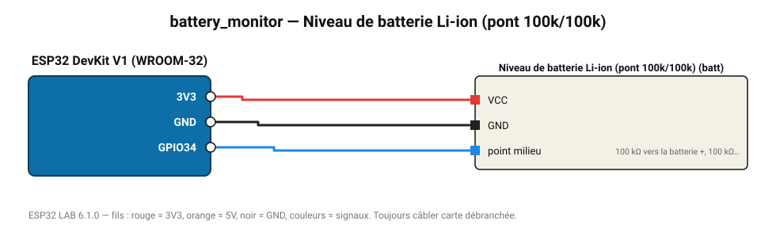

# Niveau de batterie Li-ion (pont 100k/100k)

Tension et pourcentage estimé d'une cellule 18650 (3,0-4,2 V) via un pont diviseur par 2.

**Carte :** ESP32 DevKit V1 (WROOM-32) — moniteur série 115200 bauds.

| ESP32 | Composant | Broche | Couleur fil | Remarque |
|---|---|---|---|---|
| 3V3 | Niveau de batterie Li-ion (pont 100k/100k) | VCC | rouge |  |
| GND | Niveau de batterie Li-ion (pont 100k/100k) | GND | noir |  |
| GPIO34 | Niveau de batterie Li-ion (pont 100k/100k) | point milieu | bleu | 100 kΩ vers la batterie +, 100 kΩ vers GND |

Toujours câbler **carte débranchée**. Masse (GND) commune entre tous les modules.
