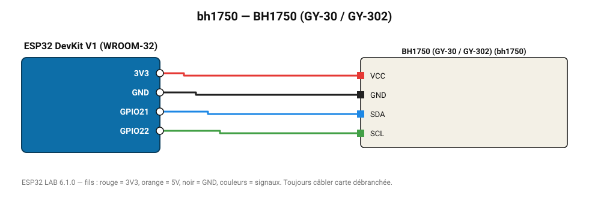

# BH1750 (GY-30 / GY-302)

Luxmètre numérique 1-65 535 lx, idéal pour l'éclairage automatique.

**Carte :** ESP32 DevKit V1 (WROOM-32) — moniteur série 115200 bauds.

| ESP32 | Composant | Broche | Couleur fil | Remarque |
|---|---|---|---|---|
| 3V3 | BH1750 (GY-30 / GY-302) | VCC | rouge |  |
| GND | BH1750 (GY-30 / GY-302) | GND | noir |  |
| GPIO21 | BH1750 (GY-30 / GY-302) | SDA | bleu |  |
| GPIO22 | BH1750 (GY-30 / GY-302) | SCL | vert |  |

Toujours câbler **carte débranchée**. Masse (GND) commune entre tous les modules.
