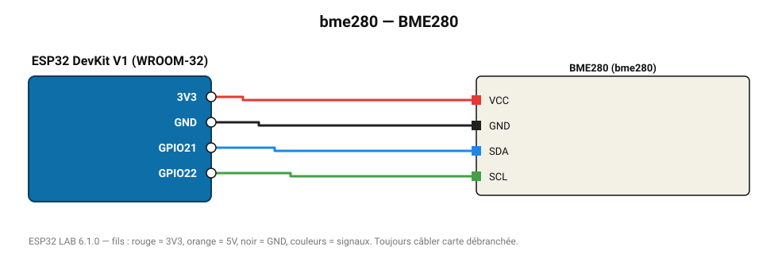

# BME280

Station météo miniature Bosch : température, humidité, pression et altitude estimée.

**Carte :** ESP32 DevKit V1 (WROOM-32) — moniteur série 115200 bauds.

| ESP32 | Composant | Broche | Couleur fil | Remarque |
|---|---|---|---|---|
| 3V3 | BME280 | VCC | rouge |  |
| GND | BME280 | GND | noir |  |
| GPIO21 | BME280 | SDA | bleu |  |
| GPIO22 | BME280 | SCL | vert |  |

Toujours câbler **carte débranchée**. Masse (GND) commune entre tous les modules.
