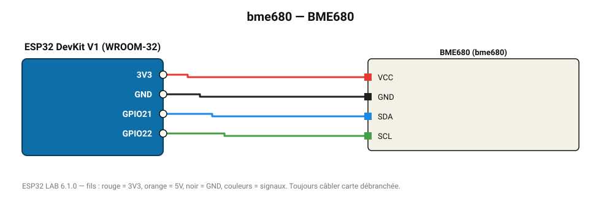

# BME680

Capteur 4-en-1 : température, humidité, pression et résistance de gaz (qualité de l'air / COV).

**Carte :** ESP32 DevKit V1 (WROOM-32) — moniteur série 115200 bauds.

| ESP32 | Composant | Broche | Couleur fil | Remarque |
|---|---|---|---|---|
| 3V3 | BME680 | VCC | rouge |  |
| GND | BME680 | GND | noir |  |
| GPIO21 | BME680 | SDA | bleu |  |
| GPIO22 | BME680 | SCL | vert |  |

Toujours câbler **carte débranchée**. Masse (GND) commune entre tous les modules.
