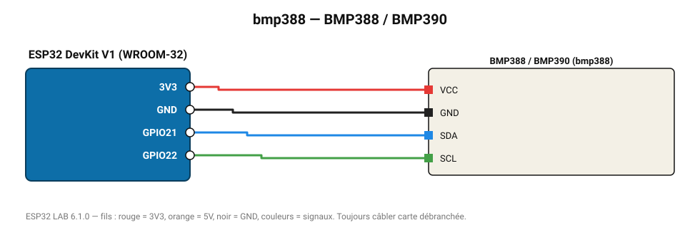

# BMP388 / BMP390

Baromètre haute précision (±0,5 m) pour drones et altimètres.

**Carte :** ESP32 DevKit V1 (WROOM-32) — moniteur série 115200 bauds.

| ESP32 | Composant | Broche | Couleur fil | Remarque |
|---|---|---|---|---|
| 3V3 | BMP388 / BMP390 | VCC | rouge |  |
| GND | BMP388 / BMP390 | GND | noir |  |
| GPIO21 | BMP388 / BMP390 | SDA | bleu |  |
| GPIO22 | BMP388 / BMP390 | SCL | vert |  |

Toujours câbler **carte débranchée**. Masse (GND) commune entre tous les modules.
