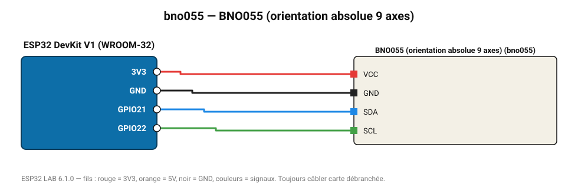

# BNO055 (orientation absolue 9 axes)

IMU Bosch avec fusion de capteurs intégrée : cap, roulis et tangage directement en degrés.

**Carte :** ESP32 DevKit V1 (WROOM-32) — moniteur série 115200 bauds.

| ESP32 | Composant | Broche | Couleur fil | Remarque |
|---|---|---|---|---|
| 3V3 | BNO055 (orientation absolue 9 axes) | VCC | rouge |  |
| GND | BNO055 (orientation absolue 9 axes) | GND | noir |  |
| GPIO21 | BNO055 (orientation absolue 9 axes) | SDA | bleu |  |
| GPIO22 | BNO055 (orientation absolue 9 axes) | SCL | vert |  |

Toujours câbler **carte débranchée**. Masse (GND) commune entre tous les modules.
