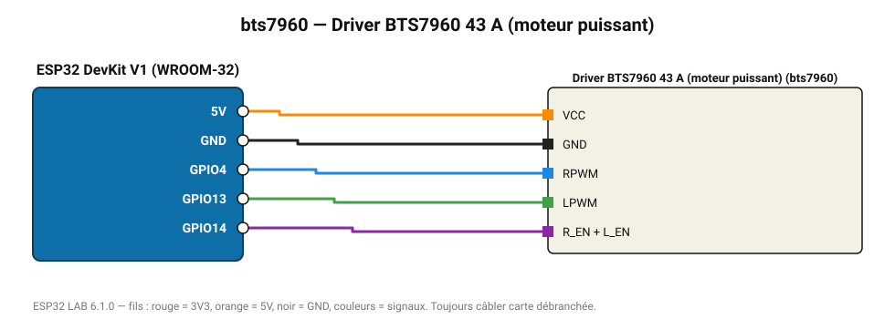

# Driver BTS7960 43 A (moteur puissant)

Pont en H de puissance pour trottinette, portail, grosse pompe.

**Carte :** ESP32 DevKit V1 (WROOM-32) — moniteur série 115200 bauds.

| ESP32 | Composant | Broche | Couleur fil | Remarque |
|---|---|---|---|---|
| 5V (VIN) | Driver BTS7960 43 A (moteur puissant) | VCC | orange |  |
| GND | Driver BTS7960 43 A (moteur puissant) | GND | noir |  |
| GPIO4 | Driver BTS7960 43 A (moteur puissant) | RPWM | bleu |  |
| GPIO13 | Driver BTS7960 43 A (moteur puissant) | LPWM | vert |  |
| GPIO14 | Driver BTS7960 43 A (moteur puissant) | R_EN + L_EN | violet |  |

Toujours câbler **carte débranchée**. Masse (GND) commune entre tous les modules.
