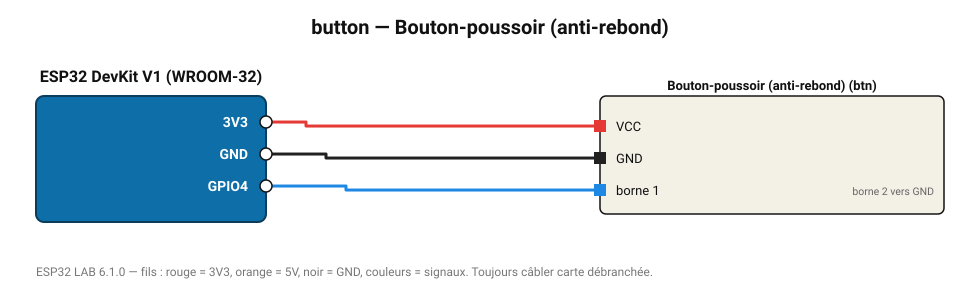

# Bouton-poussoir (anti-rebond)

Bouton avec tirage interne et anti-rebond logiciel : appui court, compteur et appui long.

**Carte :** ESP32 DevKit V1 (WROOM-32) — moniteur série 115200 bauds.

| ESP32 | Composant | Broche | Couleur fil | Remarque |
|---|---|---|---|---|
| 3V3 | Bouton-poussoir (anti-rebond) | VCC | rouge |  |
| GND | Bouton-poussoir (anti-rebond) | GND | noir |  |
| GPIO4 | Bouton-poussoir (anti-rebond) | borne 1 | bleu | borne 2 vers GND |

Toujours câbler **carte débranchée**. Masse (GND) commune entre tous les modules.
