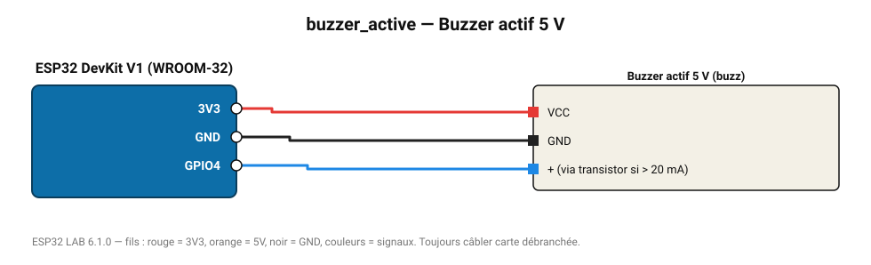

# Buzzer actif 5 V

Buzzer à oscillateur intégré : émet un bip dès qu'il est alimenté.

**Carte :** ESP32 DevKit V1 (WROOM-32) — moniteur série 115200 bauds.

| ESP32 | Composant | Broche | Couleur fil | Remarque |
|---|---|---|---|---|
| 3V3 | Buzzer actif 5 V | VCC | rouge |  |
| GND | Buzzer actif 5 V | GND | noir |  |
| GPIO4 | Buzzer actif 5 V | + (via transistor si > 20 mA) | bleu |  |

Toujours câbler **carte débranchée**. Masse (GND) commune entre tous les modules.
