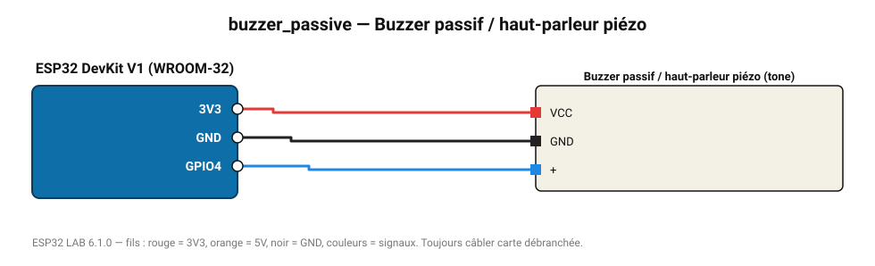

# Buzzer passif / haut-parleur piézo

Joue des notes et des mélodies avec tone() (fréquence variable).

**Carte :** ESP32 DevKit V1 (WROOM-32) — moniteur série 115200 bauds.

| ESP32 | Composant | Broche | Couleur fil | Remarque |
|---|---|---|---|---|
| 3V3 | Buzzer passif / haut-parleur piézo | VCC | rouge |  |
| GND | Buzzer passif / haut-parleur piézo | GND | noir |  |
| GPIO4 | Buzzer passif / haut-parleur piézo | + | bleu |  |

Toujours câbler **carte débranchée**. Masse (GND) commune entre tous les modules.
