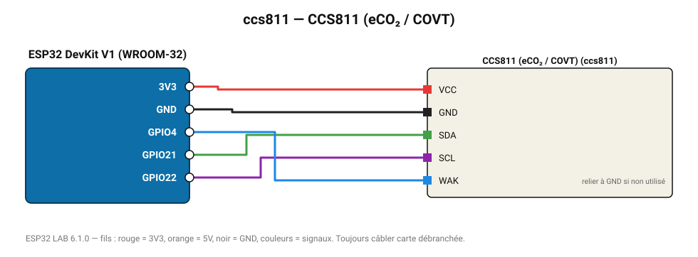

# CCS811 (eCO₂ / COVT)

Capteur MOX : COV totaux (0-1187 ppb) et CO₂ équivalent (400-8192 ppm).

**Carte :** ESP32 DevKit V1 (WROOM-32) — moniteur série 115200 bauds.

| ESP32 | Composant | Broche | Couleur fil | Remarque |
|---|---|---|---|---|
| 3V3 | CCS811 (eCO₂ / COVT) | VCC | rouge |  |
| GND | CCS811 (eCO₂ / COVT) | GND | noir |  |
| GPIO21 | CCS811 (eCO₂ / COVT) | SDA | vert |  |
| GPIO22 | CCS811 (eCO₂ / COVT) | SCL | violet |  |
| GPIO4 | CCS811 (eCO₂ / COVT) | WAK | bleu | relier à GND si non utilisé |

Toujours câbler **carte débranchée**. Masse (GND) commune entre tous les modules.
