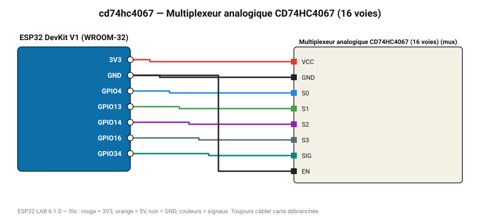

# Multiplexeur analogique CD74HC4067 (16 voies)

Lit 16 capteurs analogiques sur une seule entrée ADC grâce à 4 lignes de sélection.

**Carte :** ESP32 DevKit V1 (WROOM-32) — moniteur série 115200 bauds.

| ESP32 | Composant | Broche | Couleur fil | Remarque |
|---|---|---|---|---|
| 3V3 | Multiplexeur analogique CD74HC4067 (16 voies) | VCC | rouge |  |
| GND | Multiplexeur analogique CD74HC4067 (16 voies) | GND | noir |  |
| GPIO4 | Multiplexeur analogique CD74HC4067 (16 voies) | S0 | bleu |  |
| GPIO13 | Multiplexeur analogique CD74HC4067 (16 voies) | S1 | vert |  |
| GPIO14 | Multiplexeur analogique CD74HC4067 (16 voies) | S2 | violet |  |
| GPIO16 | Multiplexeur analogique CD74HC4067 (16 voies) | S3 | gris-bleu |  |
| GPIO34 | Multiplexeur analogique CD74HC4067 (16 voies) | SIG | turquoise |  |
| GND | Multiplexeur analogique CD74HC4067 (16 voies) | EN | noir |  |

Toujours câbler **carte débranchée**. Masse (GND) commune entre tous les modules.
