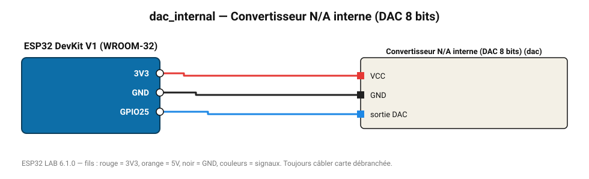

# Convertisseur N/A interne (DAC 8 bits)

Sortie de tension analogique vraie (0-3,3 V, 8 bits) sur GPIO25/26 : générateur de signal.

**Carte :** ESP32 DevKit V1 (WROOM-32) — moniteur série 115200 bauds.

| ESP32 | Composant | Broche | Couleur fil | Remarque |
|---|---|---|---|---|
| 3V3 | Convertisseur N/A interne (DAC 8 bits) | VCC | rouge |  |
| GND | Convertisseur N/A interne (DAC 8 bits) | GND | noir |  |
| GPIO25 | Convertisseur N/A interne (DAC 8 bits) | sortie DAC | bleu |  |

Toujours câbler **carte débranchée**. Masse (GND) commune entre tous les modules.
