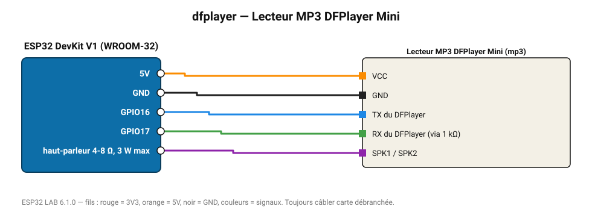

# Lecteur MP3 DFPlayer Mini

Lit des fichiers MP3 depuis une microSD vers un haut-parleur 3 W : annonces vocales, alarme sonore.

**Carte :** ESP32 DevKit V1 (WROOM-32) — moniteur série 115200 bauds.

| ESP32 | Composant | Broche | Couleur fil | Remarque |
|---|---|---|---|---|
| 5V (VIN) | Lecteur MP3 DFPlayer Mini | VCC | orange |  |
| GND | Lecteur MP3 DFPlayer Mini | GND | noir |  |
| GPIO16 | Lecteur MP3 DFPlayer Mini | TX du DFPlayer | bleu |  |
| GPIO17 | Lecteur MP3 DFPlayer Mini | RX du DFPlayer (via 1 kΩ) | vert |  |
| haut-parleur 4-8 Ω, 3 W max | Lecteur MP3 DFPlayer Mini | SPK1 / SPK2 | violet |  |

> ⚠ Alimentez Lecteur MP3 DFPlayer Mini directement en 5 V externe et reliez les masses (GND commun).

Toujours câbler **carte débranchée**. Masse (GND) commune entre tous les modules.
