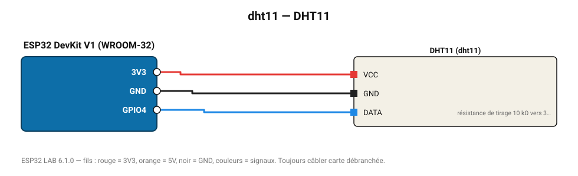

# DHT11

Capteur économique : 0-50 °C (±2 °C), 20-90 % HR (±5 %).

**Carte :** ESP32 DevKit V1 (WROOM-32) — moniteur série 115200 bauds.

| ESP32 | Composant | Broche | Couleur fil | Remarque |
|---|---|---|---|---|
| 3V3 | DHT11 | VCC | rouge |  |
| GND | DHT11 | GND | noir |  |
| GPIO4 | DHT11 | DATA | bleu | résistance de tirage 10 kΩ vers 3V3 (souvent déjà sur le module) |

Toujours câbler **carte débranchée**. Masse (GND) commune entre tous les modules.
