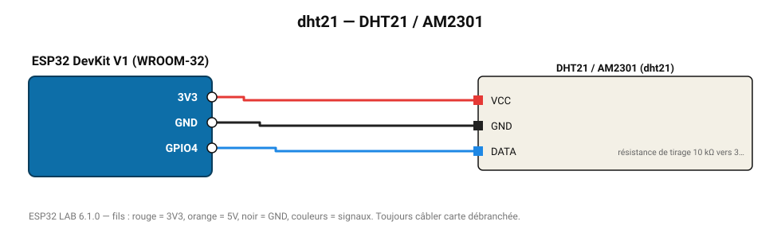

# DHT21 / AM2301

Version à câble du DHT22, boîtier plastique pour l'extérieur.

**Carte :** ESP32 DevKit V1 (WROOM-32) — moniteur série 115200 bauds.

| ESP32 | Composant | Broche | Couleur fil | Remarque |
|---|---|---|---|---|
| 3V3 | DHT21 / AM2301 | VCC | rouge |  |
| GND | DHT21 / AM2301 | GND | noir |  |
| GPIO4 | DHT21 / AM2301 | DATA | bleu | résistance de tirage 10 kΩ vers 3V3 (souvent déjà sur le module) |

Toujours câbler **carte débranchée**. Masse (GND) commune entre tous les modules.
