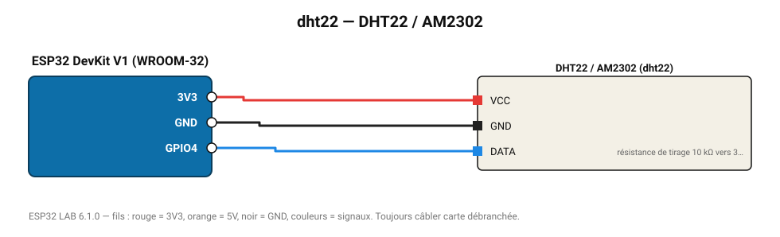

# DHT22 / AM2302

Capteur précis : -40 à 80 °C (±0,5 °C), 0-100 % HR (±2 %).

**Carte :** ESP32 DevKit V1 (WROOM-32) — moniteur série 115200 bauds.

| ESP32 | Composant | Broche | Couleur fil | Remarque |
|---|---|---|---|---|
| 3V3 | DHT22 / AM2302 | VCC | rouge |  |
| GND | DHT22 / AM2302 | GND | noir |  |
| GPIO4 | DHT22 / AM2302 | DATA | bleu | résistance de tirage 10 kΩ vers 3V3 (souvent déjà sur le module) |

Toujours câbler **carte débranchée**. Masse (GND) commune entre tous les modules.
