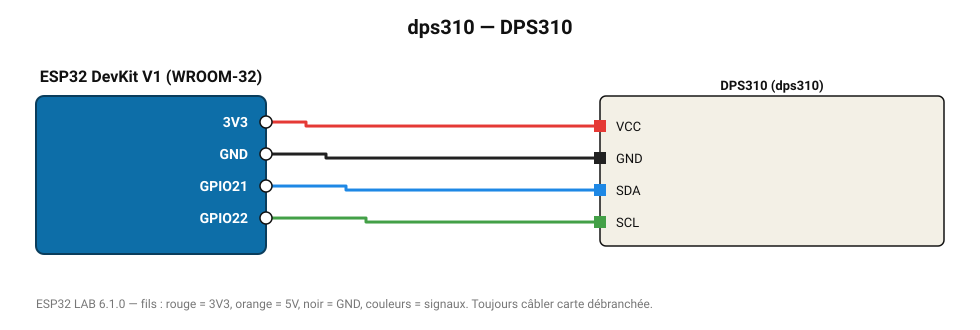

# DPS310

Baromètre Infineon ±0,002 hPa (±2 cm) — détecte un étage d'immeuble.

**Carte :** ESP32 DevKit V1 (WROOM-32) — moniteur série 115200 bauds.

| ESP32 | Composant | Broche | Couleur fil | Remarque |
|---|---|---|---|---|
| 3V3 | DPS310 | VCC | rouge |  |
| GND | DPS310 | GND | noir |  |
| GPIO21 | DPS310 | SDA | bleu |  |
| GPIO22 | DPS310 | SCL | vert |  |

Toujours câbler **carte débranchée**. Masse (GND) commune entre tous les modules.
