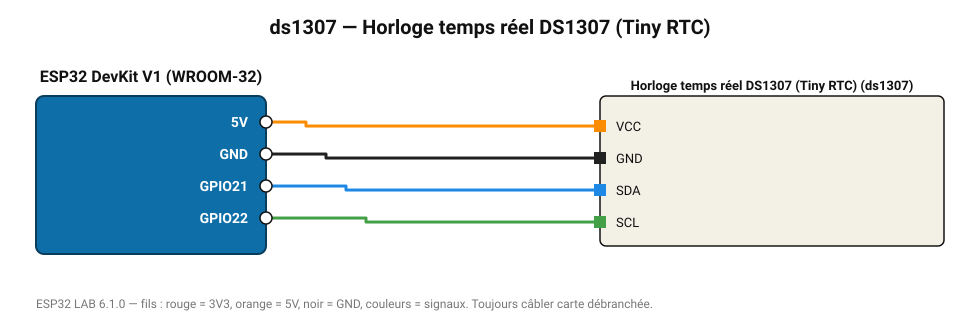

# Horloge temps réel DS1307 (Tiny RTC)

Horloge économique avec pile (dérive ~1 s/jour).

**Carte :** ESP32 DevKit V1 (WROOM-32) — moniteur série 115200 bauds.

| ESP32 | Composant | Broche | Couleur fil | Remarque |
|---|---|---|---|---|
| 5V (VIN) | Horloge temps réel DS1307 (Tiny RTC) | VCC | orange |  |
| GND | Horloge temps réel DS1307 (Tiny RTC) | GND | noir |  |
| GPIO21 | Horloge temps réel DS1307 (Tiny RTC) | SDA | bleu |  |
| GPIO22 | Horloge temps réel DS1307 (Tiny RTC) | SCL | vert |  |

Toujours câbler **carte débranchée**. Masse (GND) commune entre tous les modules.
