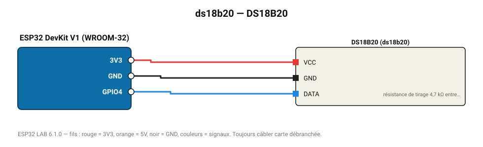

# DS18B20

Sonde de température numérique 1-Wire, -55 à 125 °C (±0,5 °C), version étanche disponible.

**Carte :** ESP32 DevKit V1 (WROOM-32) — moniteur série 115200 bauds.

| ESP32 | Composant | Broche | Couleur fil | Remarque |
|---|---|---|---|---|
| 3V3 | DS18B20 | VCC | rouge |  |
| GND | DS18B20 | GND | noir |  |
| GPIO4 | DS18B20 | DATA | bleu | résistance de tirage 4,7 kΩ entre DATA et 3V3 obligatoire |

Toujours câbler **carte débranchée**. Masse (GND) commune entre tous les modules.
