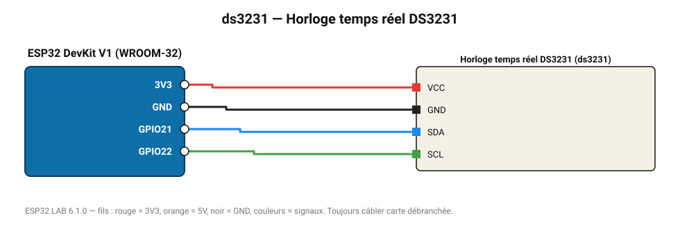

# Horloge temps réel DS3231

Horloge compensée en température (±2 ppm, ~1 min/an) avec pile CR2032 et EEPROM AT24C32.

**Carte :** ESP32 DevKit V1 (WROOM-32) — moniteur série 115200 bauds.

| ESP32 | Composant | Broche | Couleur fil | Remarque |
|---|---|---|---|---|
| 3V3 | Horloge temps réel DS3231 | VCC | rouge |  |
| GND | Horloge temps réel DS3231 | GND | noir |  |
| GPIO21 | Horloge temps réel DS3231 | SDA | bleu |  |
| GPIO22 | Horloge temps réel DS3231 | SCL | vert |  |

Toujours câbler **carte débranchée**. Masse (GND) commune entre tous les modules.
