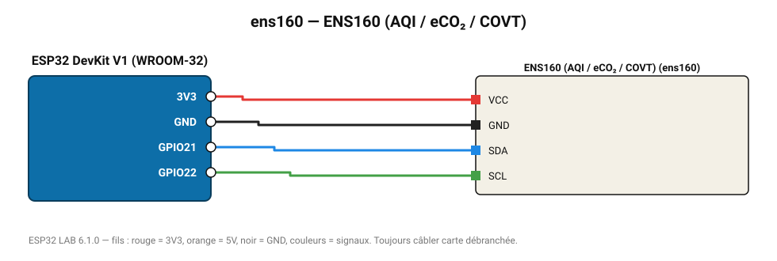

# ENS160 (AQI / eCO₂ / COVT)

Capteur ScioSense : indice de qualité de l'air UBA (1-5), COVT et eCO₂. Souvent vendu avec l'AHT21.

**Carte :** ESP32 DevKit V1 (WROOM-32) — moniteur série 115200 bauds.

| ESP32 | Composant | Broche | Couleur fil | Remarque |
|---|---|---|---|---|
| 3V3 | ENS160 (AQI / eCO₂ / COVT) | VCC | rouge |  |
| GND | ENS160 (AQI / eCO₂ / COVT) | GND | noir |  |
| GPIO21 | ENS160 (AQI / eCO₂ / COVT) | SDA | bleu |  |
| GPIO22 | ENS160 (AQI / eCO₂ / COVT) | SCL | vert |  |

Toujours câbler **carte débranchée**. Masse (GND) commune entre tous les modules.
