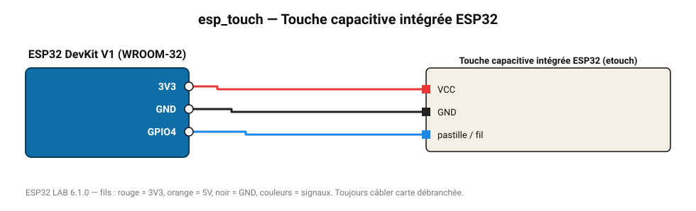

# Touche capacitive intégrée ESP32

Un simple fil ou une pastille de cuivre sur une broche TOUCH devient un bouton tactile.

**Carte :** ESP32 DevKit V1 (WROOM-32) — moniteur série 115200 bauds.

| ESP32 | Composant | Broche | Couleur fil | Remarque |
|---|---|---|---|---|
| 3V3 | Touche capacitive intégrée ESP32 | VCC | rouge |  |
| GND | Touche capacitive intégrée ESP32 | GND | noir |  |
| GPIO4 | Touche capacitive intégrée ESP32 | pastille / fil | bleu |  |

Toujours câbler **carte débranchée**. Masse (GND) commune entre tous les modules.
