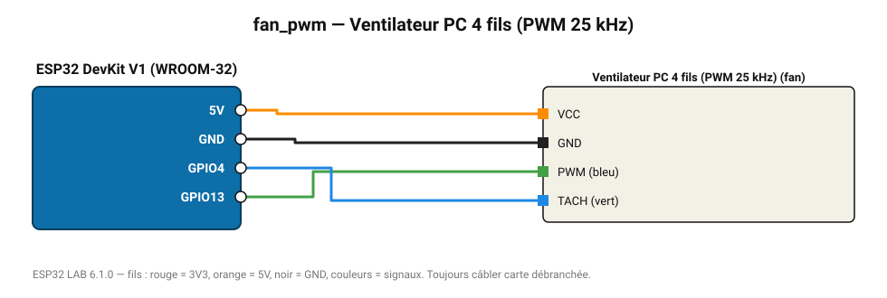

# Ventilateur PC 4 fils (PWM 25 kHz)

Ventilateur 12 V 4 broches : vitesse par PWM 25 kHz et lecture des tours/minute.

**Carte :** ESP32 DevKit V1 (WROOM-32) — moniteur série 115200 bauds.

| ESP32 | Composant | Broche | Couleur fil | Remarque |
|---|---|---|---|---|
| 5V (VIN) | Ventilateur PC 4 fils (PWM 25 kHz) | VCC | orange |  |
| GND | Ventilateur PC 4 fils (PWM 25 kHz) | GND | noir |  |
| GPIO13 | Ventilateur PC 4 fils (PWM 25 kHz) | PWM (bleu) | vert |  |
| GPIO4 | Ventilateur PC 4 fils (PWM 25 kHz) | TACH (vert) | bleu |  |

Toujours câbler **carte débranchée**. Masse (GND) commune entre tous les modules.
