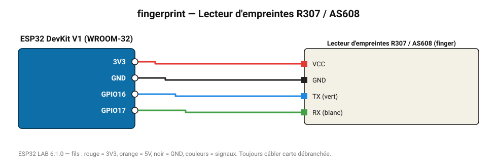

# Lecteur d'empreintes R307 / AS608

Reconnaissance d'empreintes digitales (jusqu'à 162 modèles) pour serrure ou pointeuse.

**Carte :** ESP32 DevKit V1 (WROOM-32) — moniteur série 115200 bauds.

| ESP32 | Composant | Broche | Couleur fil | Remarque |
|---|---|---|---|---|
| 3V3 | Lecteur d'empreintes R307 / AS608 | VCC | rouge |  |
| GND | Lecteur d'empreintes R307 / AS608 | GND | noir |  |
| GPIO16 | Lecteur d'empreintes R307 / AS608 | TX (vert) | bleu |  |
| GPIO17 | Lecteur d'empreintes R307 / AS608 | RX (blanc) | vert |  |

Toujours câbler **carte débranchée**. Masse (GND) commune entre tous les modules.
