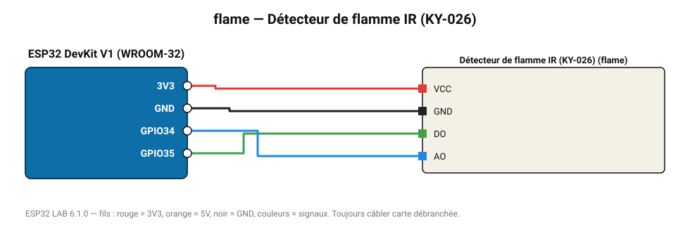

# Détecteur de flamme IR (KY-026)

Photodiode infrarouge 760-1100 nm : détecte une flamme à ~80 cm (sortie seuil + analogique).

**Carte :** ESP32 DevKit V1 (WROOM-32) — moniteur série 115200 bauds.

| ESP32 | Composant | Broche | Couleur fil | Remarque |
|---|---|---|---|---|
| 3V3 | Détecteur de flamme IR (KY-026) | VCC | rouge |  |
| GND | Détecteur de flamme IR (KY-026) | GND | noir |  |
| GPIO35 | Détecteur de flamme IR (KY-026) | DO | vert |  |
| GPIO34 | Détecteur de flamme IR (KY-026) | AO | bleu |  |

Toujours câbler **carte débranchée**. Masse (GND) commune entre tous les modules.
