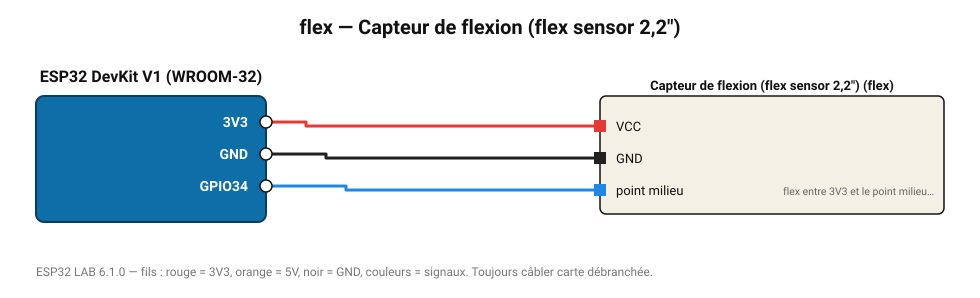

# Capteur de flexion (flex sensor 2,2")

Résistance variable 25-100 kΩ selon la courbure : gant de commande, robotique.

**Carte :** ESP32 DevKit V1 (WROOM-32) — moniteur série 115200 bauds.

| ESP32 | Composant | Broche | Couleur fil | Remarque |
|---|---|---|---|---|
| 3V3 | Capteur de flexion (flex sensor 2,2") | VCC | rouge |  |
| GND | Capteur de flexion (flex sensor 2,2") | GND | noir |  |
| GPIO34 | Capteur de flexion (flex sensor 2,2") | point milieu | bleu | flex entre 3V3 et le point milieu, 47 kΩ vers GND |

Toujours câbler **carte débranchée**. Masse (GND) commune entre tous les modules.
