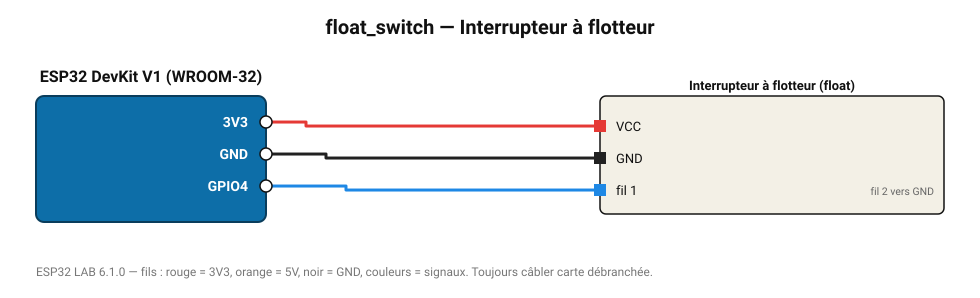

# Interrupteur à flotteur

Contact magnétique qui bascule quand le niveau d'eau atteint le flotteur.

**Carte :** ESP32 DevKit V1 (WROOM-32) — moniteur série 115200 bauds.

| ESP32 | Composant | Broche | Couleur fil | Remarque |
|---|---|---|---|---|
| 3V3 | Interrupteur à flotteur | VCC | rouge |  |
| GND | Interrupteur à flotteur | GND | noir |  |
| GPIO4 | Interrupteur à flotteur | fil 1 | bleu | fil 2 vers GND |

Toujours câbler **carte débranchée**. Masse (GND) commune entre tous les modules.
