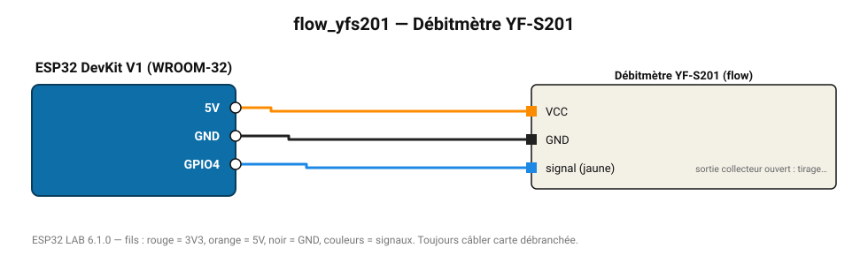

# Débitmètre YF-S201

Débitmètre à effet Hall 1-30 L/min : 7,5 impulsions par L/min.

**Carte :** ESP32 DevKit V1 (WROOM-32) — moniteur série 115200 bauds.

| ESP32 | Composant | Broche | Couleur fil | Remarque |
|---|---|---|---|---|
| 5V (VIN) | Débitmètre YF-S201 | VCC | orange |  |
| GND | Débitmètre YF-S201 | GND | noir |  |
| GPIO4 | Débitmètre YF-S201 | signal (jaune) | bleu | sortie collecteur ouvert : tirage interne activé |

Toujours câbler **carte débranchée**. Masse (GND) commune entre tous les modules.
