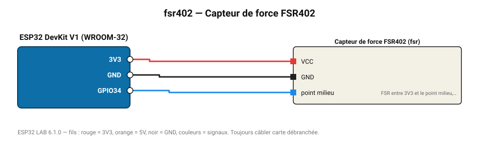

# Capteur de force FSR402

Résistance sensible à la force (0,2-20 N) : détection d'appui, pèse-lettre approximatif.

**Carte :** ESP32 DevKit V1 (WROOM-32) — moniteur série 115200 bauds.

| ESP32 | Composant | Broche | Couleur fil | Remarque |
|---|---|---|---|---|
| 3V3 | Capteur de force FSR402 | VCC | rouge |  |
| GND | Capteur de force FSR402 | GND | noir |  |
| GPIO34 | Capteur de force FSR402 | point milieu | bleu | FSR entre 3V3 et le point milieu, 10 kΩ vers GND |

Toujours câbler **carte débranchée**. Masse (GND) commune entre tous les modules.
