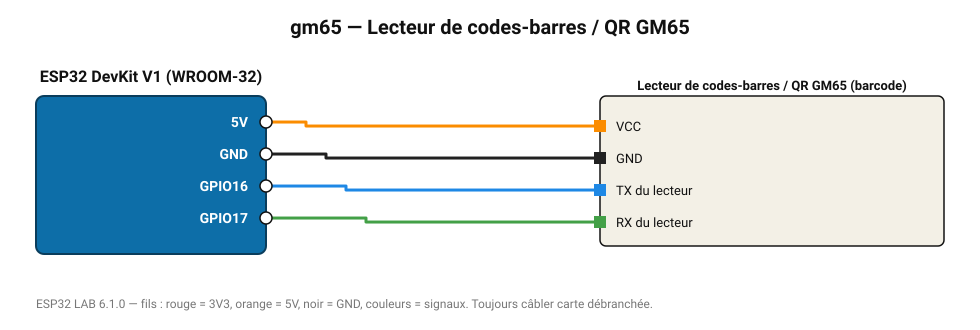

# Lecteur de codes-barres / QR GM65

Scanne codes-barres 1D et QR codes et les transmet en texte (9600 bauds).

**Carte :** ESP32 DevKit V1 (WROOM-32) — moniteur série 115200 bauds.

| ESP32 | Composant | Broche | Couleur fil | Remarque |
|---|---|---|---|---|
| 5V (VIN) | Lecteur de codes-barres / QR GM65 | VCC | orange |  |
| GND | Lecteur de codes-barres / QR GM65 | GND | noir |  |
| GPIO16 | Lecteur de codes-barres / QR GM65 | TX du lecteur | bleu |  |
| GPIO17 | Lecteur de codes-barres / QR GM65 | RX du lecteur | vert |  |

Toujours câbler **carte débranchée**. Masse (GND) commune entre tous les modules.
