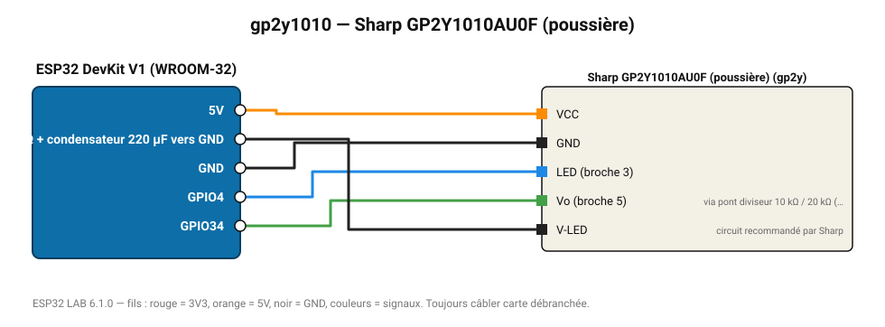

# Sharp GP2Y1010AU0F (poussière)

Capteur optique de poussière : densité en mg/m³ par impulsion infrarouge.

**Carte :** ESP32 DevKit V1 (WROOM-32) — moniteur série 115200 bauds.

| ESP32 | Composant | Broche | Couleur fil | Remarque |
|---|---|---|---|---|
| 5V (VIN) | Sharp GP2Y1010AU0F (poussière) | VCC | orange |  |
| GND | Sharp GP2Y1010AU0F (poussière) | GND | noir |  |
| GPIO4 | Sharp GP2Y1010AU0F (poussière) | LED (broche 3) | bleu |  |
| GPIO34 | Sharp GP2Y1010AU0F (poussière) | Vo (broche 5) | vert | via pont diviseur 10 kΩ / 20 kΩ (sortie jusqu'à 3,6 V) |
| 5V via 150 Ω + condensateur 220 µF vers GND | Sharp GP2Y1010AU0F (poussière) | V-LED | noir | circuit recommandé par Sharp |

Toujours câbler **carte débranchée**. Masse (GND) commune entre tous les modules.
