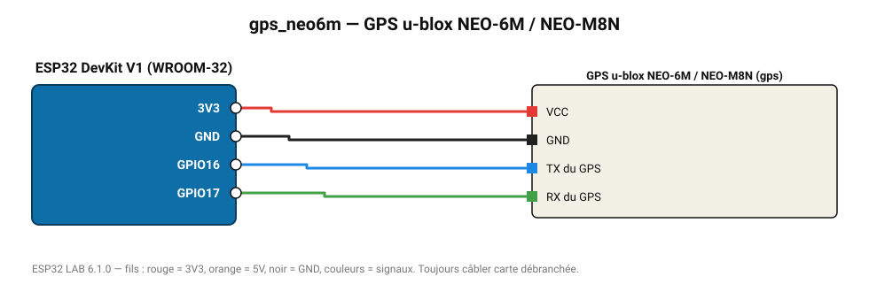

# GPS u-blox NEO-6M / NEO-M8N

Position, altitude, vitesse, heure UTC et nombre de satellites (trames NMEA 9600 bauds).

**Carte :** ESP32 DevKit V1 (WROOM-32) — moniteur série 115200 bauds.

| ESP32 | Composant | Broche | Couleur fil | Remarque |
|---|---|---|---|---|
| 3V3 | GPS u-blox NEO-6M / NEO-M8N | VCC | rouge |  |
| GND | GPS u-blox NEO-6M / NEO-M8N | GND | noir |  |
| GPIO16 | GPS u-blox NEO-6M / NEO-M8N | TX du GPS | bleu |  |
| GPIO17 | GPS u-blox NEO-6M / NEO-M8N | RX du GPS | vert |  |

Toujours câbler **carte débranchée**. Masse (GND) commune entre tous les modules.
