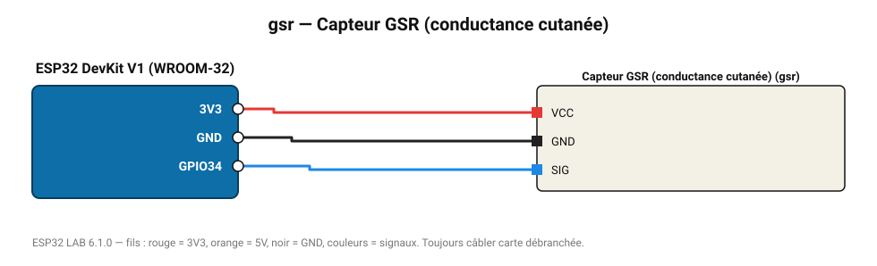

# Capteur GSR (conductance cutanée)

Mesure la réponse électrodermale (sudation) : émotion, stress, détecteur de mensonge ludique.

**Carte :** ESP32 DevKit V1 (WROOM-32) — moniteur série 115200 bauds.

| ESP32 | Composant | Broche | Couleur fil | Remarque |
|---|---|---|---|---|
| 3V3 | Capteur GSR (conductance cutanée) | VCC | rouge |  |
| GND | Capteur GSR (conductance cutanée) | GND | noir |  |
| GPIO34 | Capteur GSR (conductance cutanée) | SIG | bleu |  |

Toujours câbler **carte débranchée**. Masse (GND) commune entre tous les modules.
