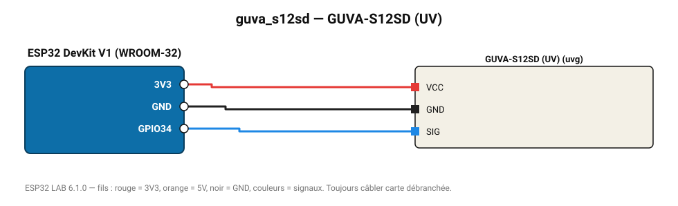

# GUVA-S12SD (UV)

Photodiode UV 240-370 nm : indice UV approximatif (tension / 0,1 V).

**Carte :** ESP32 DevKit V1 (WROOM-32) — moniteur série 115200 bauds.

| ESP32 | Composant | Broche | Couleur fil | Remarque |
|---|---|---|---|---|
| 3V3 | GUVA-S12SD (UV) | VCC | rouge |  |
| GND | GUVA-S12SD (UV) | GND | noir |  |
| GPIO34 | GUVA-S12SD (UV) | SIG | bleu |  |

Toujours câbler **carte débranchée**. Masse (GND) commune entre tous les modules.
