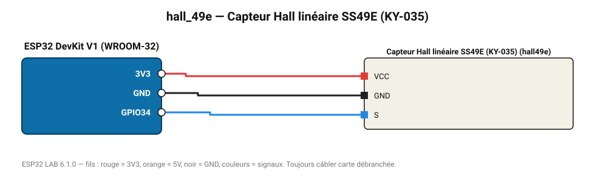

# Capteur Hall linéaire SS49E (KY-035)

Sortie analogique proportionnelle au champ magnétique (±1000 G, 1,4 mV/G).

**Carte :** ESP32 DevKit V1 (WROOM-32) — moniteur série 115200 bauds.

| ESP32 | Composant | Broche | Couleur fil | Remarque |
|---|---|---|---|---|
| 3V3 | Capteur Hall linéaire SS49E (KY-035) | VCC | rouge |  |
| GND | Capteur Hall linéaire SS49E (KY-035) | GND | noir |  |
| GPIO34 | Capteur Hall linéaire SS49E (KY-035) | S | bleu |  |

Toujours câbler **carte débranchée**. Masse (GND) commune entre tous les modules.
