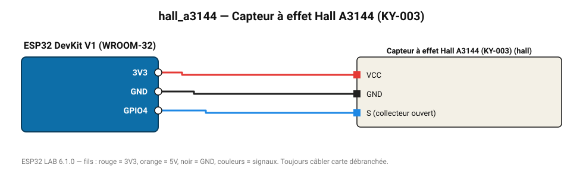

# Capteur à effet Hall A3144 (KY-003)

Interrupteur magnétique : détecte le pôle sud d'un aimant (compte-tours, fin de course).

**Carte :** ESP32 DevKit V1 (WROOM-32) — moniteur série 115200 bauds.

| ESP32 | Composant | Broche | Couleur fil | Remarque |
|---|---|---|---|---|
| 3V3 | Capteur à effet Hall A3144 (KY-003) | VCC | rouge |  |
| GND | Capteur à effet Hall A3144 (KY-003) | GND | noir |  |
| GPIO4 | Capteur à effet Hall A3144 (KY-003) | S (collecteur ouvert) | bleu |  |

Toujours câbler **carte débranchée**. Masse (GND) commune entre tous les modules.
