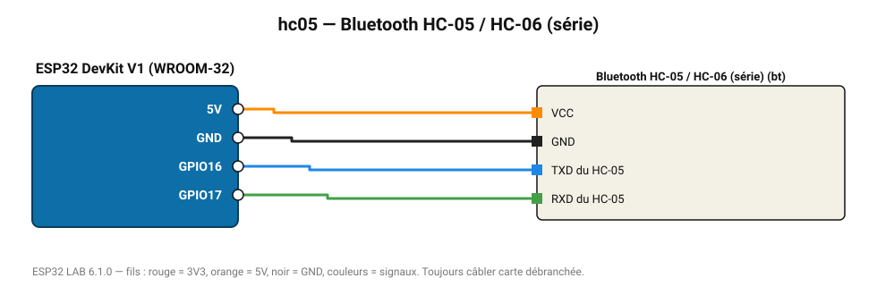

# Bluetooth HC-05 / HC-06 (série)

Pont série Bluetooth classique : dialogue avec une application Android « terminal Bluetooth ».

**Carte :** ESP32 DevKit V1 (WROOM-32) — moniteur série 115200 bauds.

| ESP32 | Composant | Broche | Couleur fil | Remarque |
|---|---|---|---|---|
| 5V (VIN) | Bluetooth HC-05 / HC-06 (série) | VCC | orange |  |
| GND | Bluetooth HC-05 / HC-06 (série) | GND | noir |  |
| GPIO16 | Bluetooth HC-05 / HC-06 (série) | TXD du HC-05 | bleu |  |
| GPIO17 | Bluetooth HC-05 / HC-06 (série) | RXD du HC-05 | vert |  |

Toujours câbler **carte débranchée**. Masse (GND) commune entre tous les modules.
