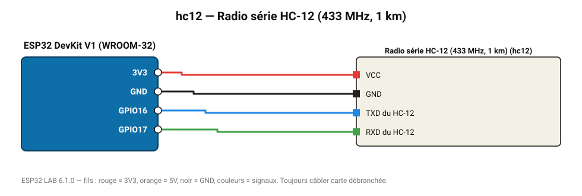

# Radio série HC-12 (433 MHz, 1 km)

Module radio transparent : tout ce qui est écrit sur la liaison série est reçu par l'autre HC-12.

**Carte :** ESP32 DevKit V1 (WROOM-32) — moniteur série 115200 bauds.

| ESP32 | Composant | Broche | Couleur fil | Remarque |
|---|---|---|---|---|
| 3V3 | Radio série HC-12 (433 MHz, 1 km) | VCC | rouge |  |
| GND | Radio série HC-12 (433 MHz, 1 km) | GND | noir |  |
| GPIO16 | Radio série HC-12 (433 MHz, 1 km) | TXD du HC-12 | bleu |  |
| GPIO17 | Radio série HC-12 (433 MHz, 1 km) | RXD du HC-12 | vert |  |

Toujours câbler **carte débranchée**. Masse (GND) commune entre tous les modules.
