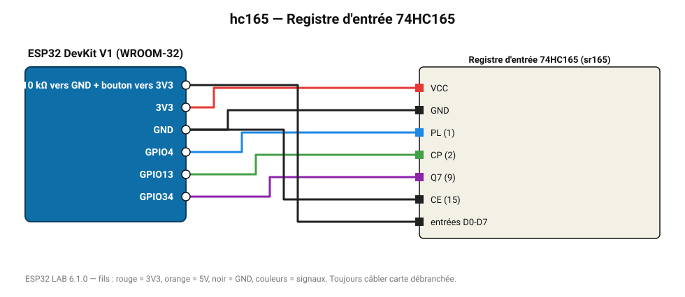

# Registre d'entrée 74HC165

8 entrées numériques supplémentaires avec 3 fils (chaînable) : clavier de boutons.

**Carte :** ESP32 DevKit V1 (WROOM-32) — moniteur série 115200 bauds.

| ESP32 | Composant | Broche | Couleur fil | Remarque |
|---|---|---|---|---|
| 3V3 | Registre d'entrée 74HC165 | VCC | rouge |  |
| GND | Registre d'entrée 74HC165 | GND | noir |  |
| GPIO4 | Registre d'entrée 74HC165 | PL (1) | bleu |  |
| GPIO13 | Registre d'entrée 74HC165 | CP (2) | vert |  |
| GPIO34 | Registre d'entrée 74HC165 | Q7 (9) | violet |  |
| GND | Registre d'entrée 74HC165 | CE (15) | noir |  |
| 10 kΩ vers GND + bouton vers 3V3 | Registre d'entrée 74HC165 | entrées D0-D7 | noir |  |

Toujours câbler **carte débranchée**. Masse (GND) commune entre tous les modules.
