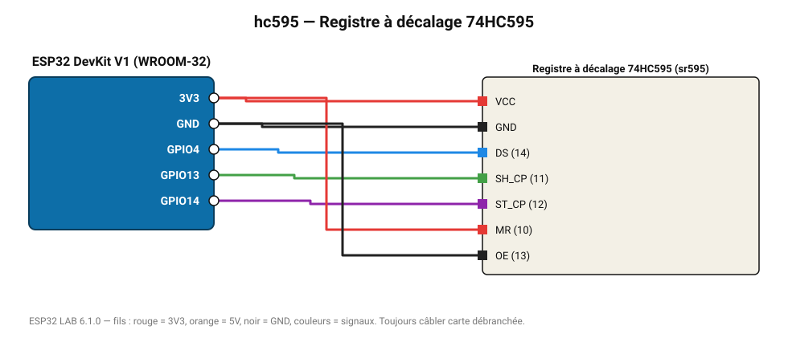

# Registre à décalage 74HC595

8 sorties supplémentaires avec 3 fils (chaînable) : barregraphe, afficheurs.

**Carte :** ESP32 DevKit V1 (WROOM-32) — moniteur série 115200 bauds.

| ESP32 | Composant | Broche | Couleur fil | Remarque |
|---|---|---|---|---|
| 3V3 | Registre à décalage 74HC595 | VCC | rouge |  |
| GND | Registre à décalage 74HC595 | GND | noir |  |
| GPIO4 | Registre à décalage 74HC595 | DS (14) | bleu |  |
| GPIO13 | Registre à décalage 74HC595 | SH_CP (11) | vert |  |
| GPIO14 | Registre à décalage 74HC595 | ST_CP (12) | violet |  |
| 3V3 | Registre à décalage 74HC595 | MR (10) | rouge |  |
| GND | Registre à décalage 74HC595 | OE (13) | noir |  |

Toujours câbler **carte débranchée**. Masse (GND) commune entre tous les modules.
