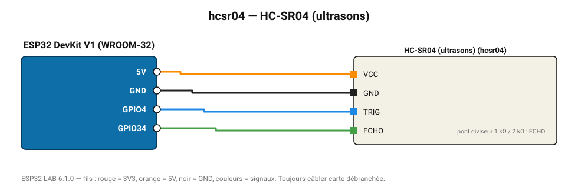

# HC-SR04 (ultrasons)

Télémètre à ultrasons 2-400 cm (résolution 3 mm), le grand classique des robots.

**Carte :** ESP32 DevKit V1 (WROOM-32) — moniteur série 115200 bauds.

| ESP32 | Composant | Broche | Couleur fil | Remarque |
|---|---|---|---|---|
| 5V (VIN) | HC-SR04 (ultrasons) | VCC | orange |  |
| GND | HC-SR04 (ultrasons) | GND | noir |  |
| GPIO4 | HC-SR04 (ultrasons) | TRIG | bleu |  |
| GPIO34 | HC-SR04 (ultrasons) | ECHO | vert | pont diviseur 1 kΩ / 2 kΩ : ECHO sort du 5 V |

> ⚠ HC-SR04 (ultrasons) : la broche ECHO délivre 5 V : utilisez un pont diviseur (1 kΩ / 2 kΩ) ou un convertisseur de niveau.

Toujours câbler **carte débranchée**. Masse (GND) commune entre tous les modules.
