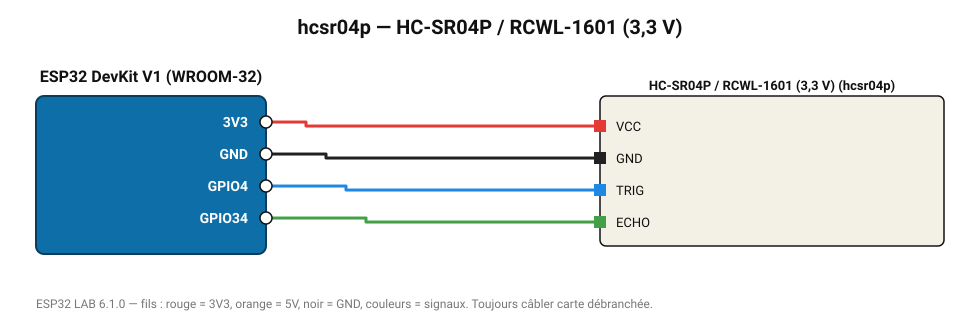

# HC-SR04P / RCWL-1601 (3,3 V)

Variante 3-5,5 V du HC-SR04 : compatible directement 3,3 V, sans pont diviseur.

**Carte :** ESP32 DevKit V1 (WROOM-32) — moniteur série 115200 bauds.

| ESP32 | Composant | Broche | Couleur fil | Remarque |
|---|---|---|---|---|
| 3V3 | HC-SR04P / RCWL-1601 (3,3 V) | VCC | rouge |  |
| GND | HC-SR04P / RCWL-1601 (3,3 V) | GND | noir |  |
| GPIO4 | HC-SR04P / RCWL-1601 (3,3 V) | TRIG | bleu |  |
| GPIO34 | HC-SR04P / RCWL-1601 (3,3 V) | ECHO | vert |  |

Toujours câbler **carte débranchée**. Masse (GND) commune entre tous les modules.
