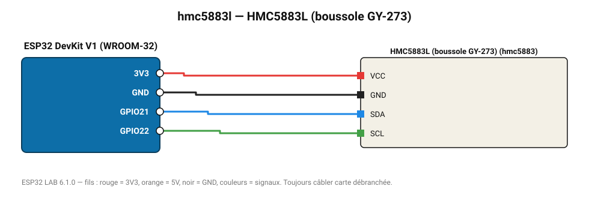

# HMC5883L (boussole GY-273)

Magnétomètre 3 axes : cap magnétique en degrés (module d'origine Honeywell).

**Carte :** ESP32 DevKit V1 (WROOM-32) — moniteur série 115200 bauds.

| ESP32 | Composant | Broche | Couleur fil | Remarque |
|---|---|---|---|---|
| 3V3 | HMC5883L (boussole GY-273) | VCC | rouge |  |
| GND | HMC5883L (boussole GY-273) | GND | noir |  |
| GPIO21 | HMC5883L (boussole GY-273) | SDA | bleu |  |
| GPIO22 | HMC5883L (boussole GY-273) | SCL | vert |  |

Toujours câbler **carte débranchée**. Masse (GND) commune entre tous les modules.
