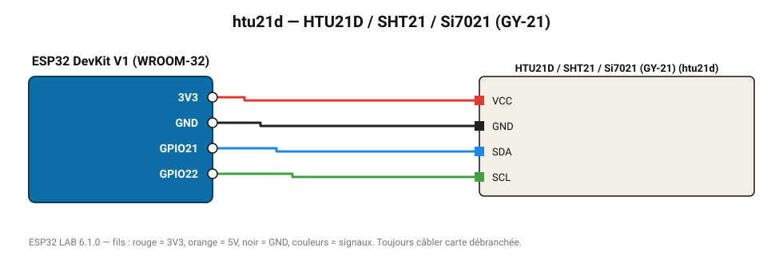

# HTU21D / SHT21 / Si7021 (GY-21)

Capteur température/humidité compatible SHT21, module GY-21.

**Carte :** ESP32 DevKit V1 (WROOM-32) — moniteur série 115200 bauds.

| ESP32 | Composant | Broche | Couleur fil | Remarque |
|---|---|---|---|---|
| 3V3 | HTU21D / SHT21 / Si7021 (GY-21) | VCC | rouge |  |
| GND | HTU21D / SHT21 / Si7021 (GY-21) | GND | noir |  |
| GPIO21 | HTU21D / SHT21 / Si7021 (GY-21) | SDA | bleu |  |
| GPIO22 | HTU21D / SHT21 / Si7021 (GY-21) | SCL | vert |  |

Toujours câbler **carte débranchée**. Masse (GND) commune entre tous les modules.
