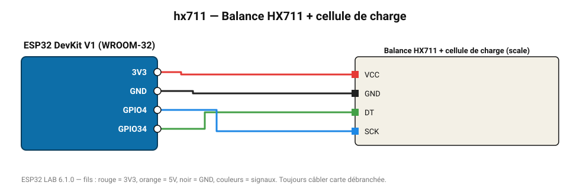

# Balance HX711 + cellule de charge

Convertisseur 24 bits pour cellule de charge : balance de cuisine, ruche connectée, niveau de réservoir.

**Carte :** ESP32 DevKit V1 (WROOM-32) — moniteur série 115200 bauds.

| ESP32 | Composant | Broche | Couleur fil | Remarque |
|---|---|---|---|---|
| 3V3 | Balance HX711 + cellule de charge | VCC | rouge |  |
| GND | Balance HX711 + cellule de charge | GND | noir |  |
| GPIO34 | Balance HX711 + cellule de charge | DT | vert |  |
| GPIO4 | Balance HX711 + cellule de charge | SCK | bleu |  |

Toujours câbler **carte débranchée**. Masse (GND) commune entre tous les modules.
