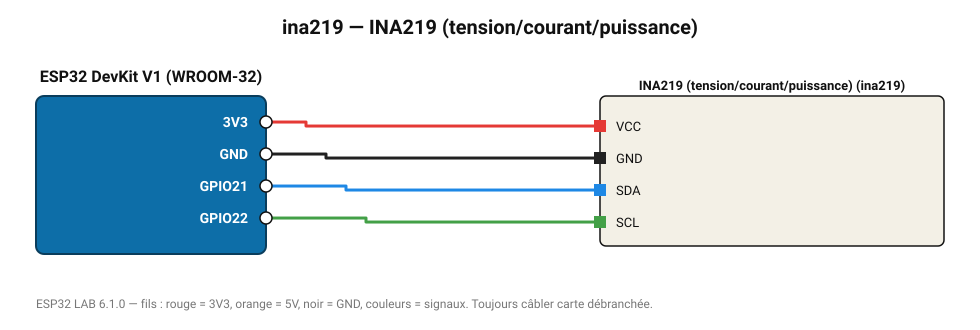

# INA219 (tension/courant/puissance)

Wattmètre continu jusqu'à 26 V / 3,2 A : consommation d'un montage, suivi de batterie.

**Carte :** ESP32 DevKit V1 (WROOM-32) — moniteur série 115200 bauds.

| ESP32 | Composant | Broche | Couleur fil | Remarque |
|---|---|---|---|---|
| 3V3 | INA219 (tension/courant/puissance) | VCC | rouge |  |
| GND | INA219 (tension/courant/puissance) | GND | noir |  |
| GPIO21 | INA219 (tension/courant/puissance) | SDA | bleu |  |
| GPIO22 | INA219 (tension/courant/puissance) | SCL | vert |  |

Toujours câbler **carte débranchée**. Masse (GND) commune entre tous les modules.
