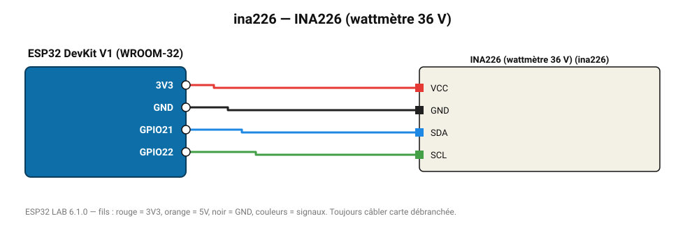

# INA226 (wattmètre 36 V)

Wattmètre haute précision jusqu'à 36 V ; shunt de 0,1 Ω sur les modules courants.

**Carte :** ESP32 DevKit V1 (WROOM-32) — moniteur série 115200 bauds.

| ESP32 | Composant | Broche | Couleur fil | Remarque |
|---|---|---|---|---|
| 3V3 | INA226 (wattmètre 36 V) | VCC | rouge |  |
| GND | INA226 (wattmètre 36 V) | GND | noir |  |
| GPIO21 | INA226 (wattmètre 36 V) | SDA | bleu |  |
| GPIO22 | INA226 (wattmètre 36 V) | SCL | vert |  |

Toujours câbler **carte débranchée**. Masse (GND) commune entre tous les modules.
